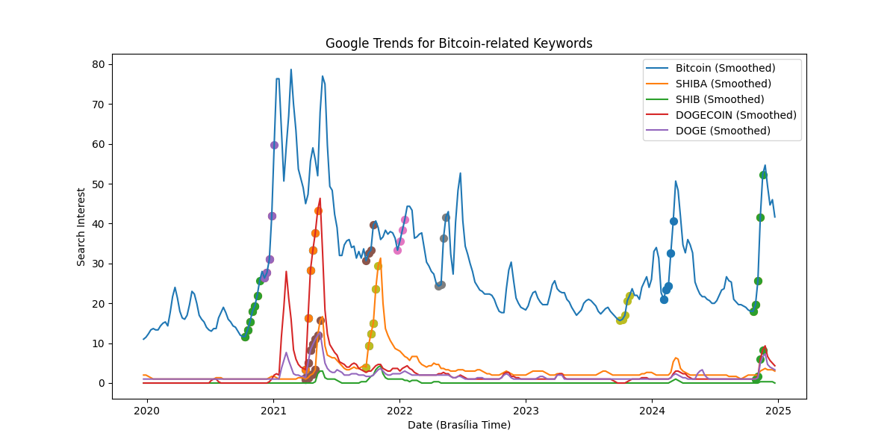
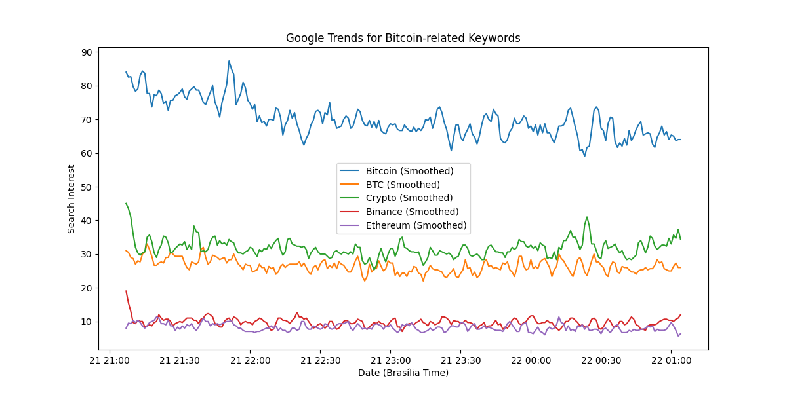

# Bitcoin Trend Alert in Google Trends

This script monitors the Google Trends data for the keyword "Cryptos" and marks a graph when a "streak" (period of prolonged growth) in interest is detected for "Cryptos".

## Functionality

- **Trend Monitoring**: The script uses the [PyTrends](https://github.com/GeneralMills/pytrends) library, an unofficial API for Google Trends, to collect data on the interest for "Bitcoin" and related keywords.
- **Prolonged Growth Detection**: The script calculates the rate of change in interest for "Bitcoin" and identifies periods of prolonged growth, i.e., consecutive periods of significant increase in interest.

## Prerequisites

1. **Python 3.x** installed.
2. **Required Libraries**:
   - `pandas`
   - `pytrends`
   - `requests`
   
   Install the required libraries using `pip`:

   ```bash
   pip install pandas pytrends requests




